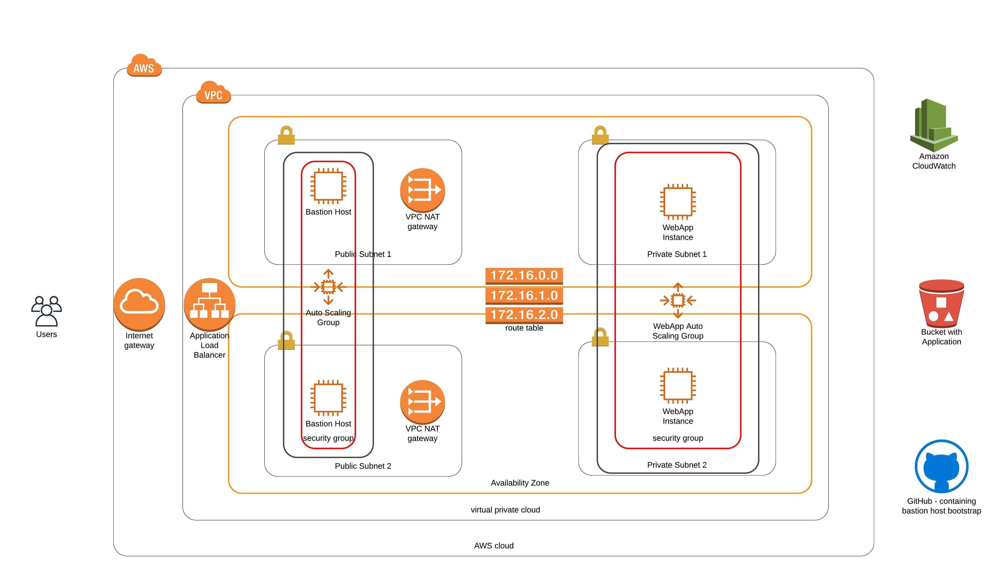

# Udactiy Cloud DevOps ND - Project-2 - HA web app using CloudFormation

This is a project for the [Udacity Devops Engineer Nanodegree](https://eu.udacity.com/course/cloud-dev-ops-nanodegree--nd9991) program.

The task is to deploy a high availability static website. The website should be hosted on servers within
private subnets. All trafic to the servers should be routed through NAT gateways located in public subnets.
For high availability there shouldn't be any single point of failure and we should leverage auto scaling
as well as security best practices.

### Creating the stack 

To deploy the cloudformation stack, there's a helper script included in the repository. See below:

`./create-stack.sh **stack_name** **template_file** **parameters_file** **region** [aws-cli-opts]`

e.g.

`./create-stack.sh udacitystack cfInfrastructure.yml infrastructure-parameters.json us-west-2`

Below is the infrastructure diagram that visualises what this cloudformation script deploys:




### SSH Forwarding

In order to troubleshoot what might have gone wrong on the WebServers, you will have to enable SSH to these from 
the Bastion hosts. Below is SecurityIngressRule required for the WebServerSecurityGroup:

```
            - IpProtocol: tcp
              FromPort: 22
              ToPort: 22
              SourceSecurityGroupId: !GetAtt BastionSecurityGroup.GroupId
```

To enable ssh agent forwarding you need to add your SSH private key to Keychain so it's automatically available
to ssh.

#### Step 1 - Store the key in the Keychain
`ssh-add -K [your-private-key]`

#### Step 2 - Configure SSH to always use the keychain
In `.ssh/config` file, add the following lines:
```Host *
  UseKeychain yes
  AddKeysToAgent yes
  IdentityFile ~/.ssh/id_rsa
```

The `UseKeychain yes` is the *key* part, which tells SSH to look in your keychain for the key passphrase.

#### SSH into your Instance
`ssh -A <user>@<bastionhost>`